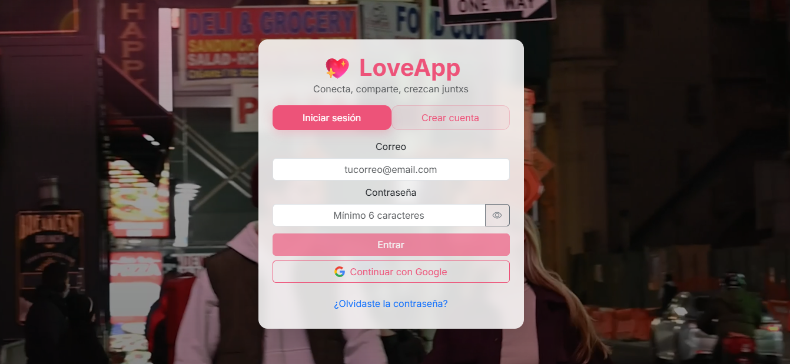
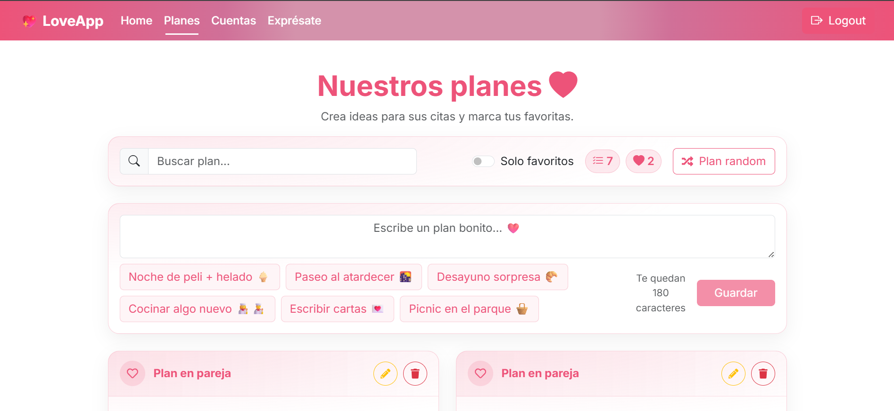
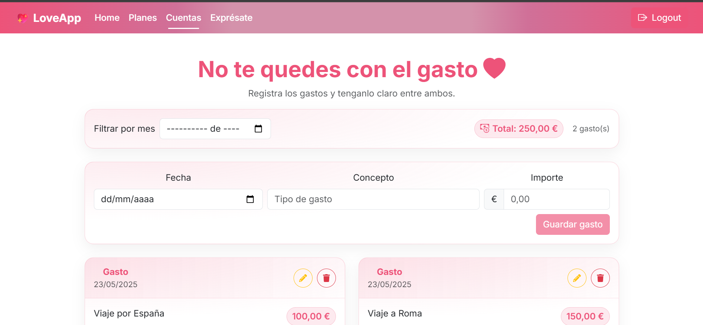

# LoveApp 💖

Herramienta para parejas hecha con **React + Firebase**. La idea es **ayudar a comunicarse y compartir** cosas simples del día a día: planes, notas, recuerdos y gastos — con una interfaz cálida y fácil de usar.

**Demo:** https://love-app-delta.vercel.app/  
**Repo:** https://github.com/MaxDanna26/loveApp

> Hecho con ❤️ — **LoveApp™ by Maximiliano Danna**

---

## ✨ Funcionalidades

- **Login**: email/contraseña, Google Sign-In y reset por email. Pantalla con **video de fondo** y tarjeta “glass”.
- **Home / Galería**: subida a **ImgBB**, “ver más” a partir de 6, **preview** en modal y **confirmación de borrado**.
- **Planes**: crear/editar/eliminar, **favoritos**, “**Plan random**”, orden **favoritos primero** y luego recientes.
- **Exprésate**: notas con **texto + emojis**, contador, **sugerencias rápidas**, ver más/menos, borrar con confirmación.
- **Cuentas (gastos)**: CRUD con cards limpias, **modal de edición** y totales claros.
- **UI/UX**: **Bootstrap 5 + Bootstrap Icons** con **tema rosa** `#ED5379` (primario) y acentos dorado/verde. Micro-interacciones y accesibilidad básica.

---

## 🖼️ Capturas

- 
- 
- 
- 

---

## 🧱 Stack

- **Frontend:** React + Vite, React Router, Bootstrap 5, Bootstrap Icons
- **BaaS:** Firebase (**Auth**, **Firestore**, **Storage**)
- **Imágenes:** ImgBB (hosteo vía API)
- **Gestor de paquetes:** npm

## 🧱 Estructura
- /src
  /components
    /Login
    /Home
    /Plans
    /Express
    /Counts
    /Layout
  /provider/UserProvider.jsx
  /services/firebase.js
  /services/auth.js
  /services/Router.jsx
/theme.css

## 🧱 Scripts
npm run dev      # desarrollo
npm run build    # build producción
npm run preview  # previsualizar build

## 🤝 Contribuir

¡Se aceptan PRs y issues! Abrí un issue con contexto y pasos para reproducir

## 🚀 Empezar

### 1) Clonar e instalar

```bash
git clone https://github.com/MaxDanna26/loveApp.git
cd loveApp
npm i


